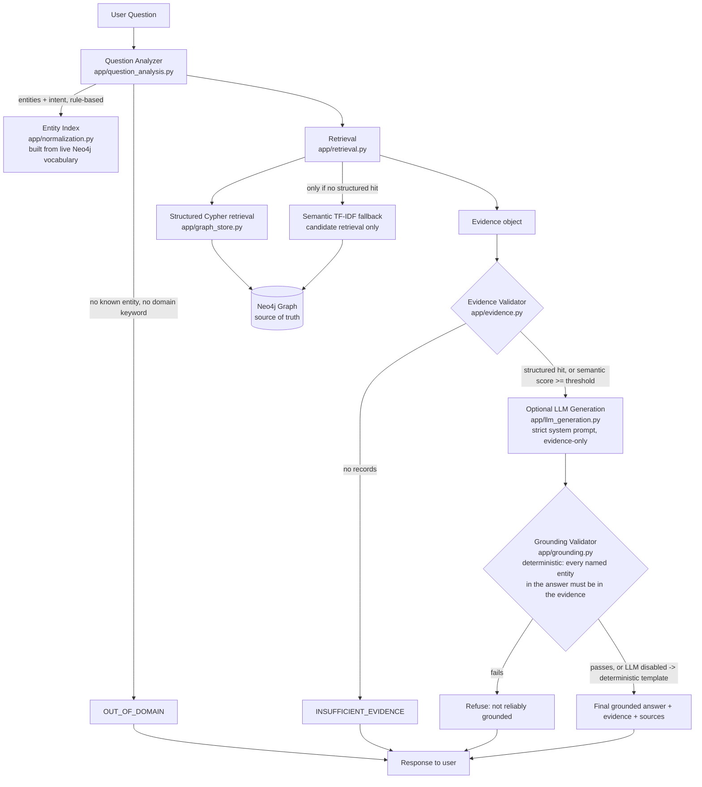

# Architecture

## Why each stage exists

1. **Question Analyzer / Entity Index** — deterministic keyword + known-vocabulary
   matching (`app/question_analysis.py`, `app/normalization.py`). The domain
   vocabulary is small and fully enumerable from the graph, so a rule-based
   classifier is both sufficient and fully auditable — there is no opaque
   intent classifier that could silently generalize past the dataset.
2. **Structured retrieval first** (`app/retrieval.py`, `app/graph_store.py`) —
   every list/lookup/aggregation question is answered by a parametrized
   Cypher query. Semantic (TF-IDF) retrieval only runs when no deterministic
   query intent matched, and its hits are candidates, not proof.
3. **Evidence Validator** (`app/evidence.py`) — the single gate the LLM must
   pass through. If it says insufficient, `app/pipeline.py` returns the
   refusal directly and **never calls the LLM**.
4. **Optional LLM Generation** (`app/llm_generation.py`) — only phrasing, only
   given the retrieved evidence, under a strict "evidence is the only source
   of truth" system prompt. If no API key is configured, a deterministic
   template produces the answer instead — the system is fully functional
   without an LLM.
5. **Grounding Validator** (`app/grounding.py`) — independently re-checks the
   LLM's output: every dataset entity name it mentions must appear in the
   evidence actually retrieved for this question. This is deterministic
   (string/vocabulary matching), not another LLM call grading itself.

See `README.md` for the three refusal modes and example Q&A, and
`DATA_CLEANING.md` for how the raw spreadsheet became this graph schema.
